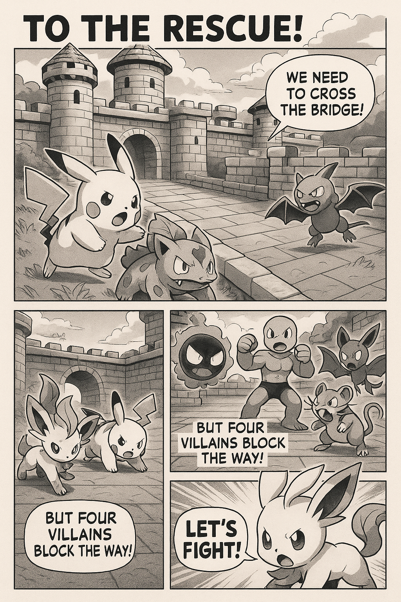
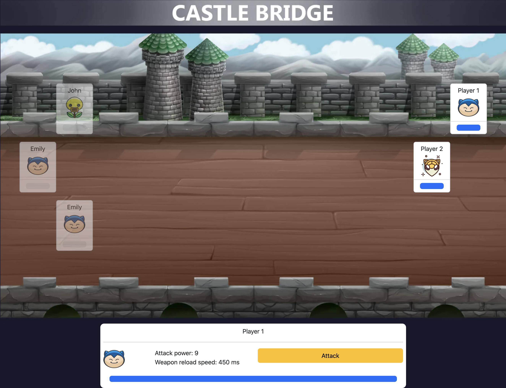
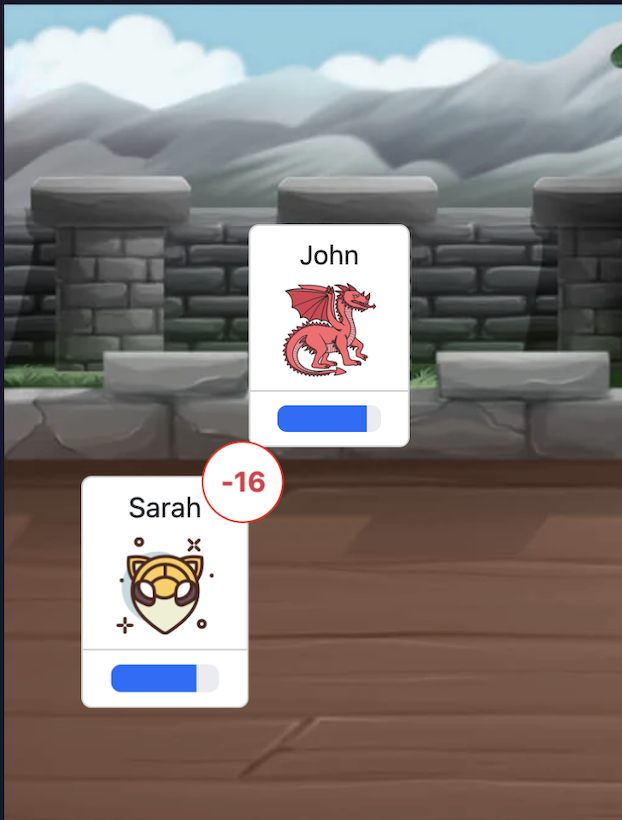
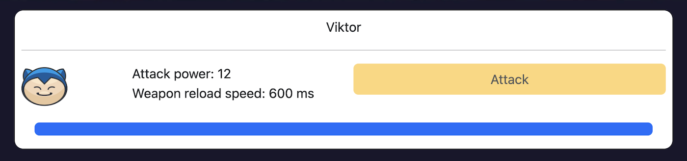

# Castle Bridge

A real-time multiplayer battle game built with Angular and Socket.IO. The right team represents heroes, the left team represents villains. The goal is to defeat the opposing team. The team with at least one surviving character wins.

**🎮 [Play Castle Bridge](https://castle-bridge.onrender.com/)**


# Story begins




## 🏗️ Architecture

This project follows **Domain-Driven Design (DDD)** principles with a **ports and adapters** architecture:

```
src/app/game/
├── domain/          # Core business logic
│   ├── entities/    # Unit, Score
│   ├── events/      # AttackOccurred, GameState
│   └── repositories/# Repository interfaces
├── application/     # Use cases and facades
├── infrastructure/  # External integrations (Socket.IO)
└── ui/             # Components, animations, pipes
```

## 🚀 Getting Started

```bash
npm install
npm start
```

Open [http://localhost:4200](http://localhost:4200) and click "Join Game". When the first player joins, a countdown begins before the villain team starts attacking the hero team. The game also starts immediately if any hero attacks before the countdown ends.

## 🎯 Game Features

- **Real-time multiplayer** - Multiple players can join and battle simultaneously
- **Dynamic teams** - Enemies spawn randomly when the game starts
- **Session management** - Refreshing the page will reset your session and remove your character
- **Keyboard controls** - Use spacebar to attack
- **Visual feedback** - Damage indicators and animations

## 💥 Taking Damage

When a character takes damage, a visual indicator shows how many health points were lost. Attack power is assigned randomly when a player registers.



## ⚔️ Dealing Damage

To attack, press the spacebar or click the "Attack" button. After each attack, your character needs time to prepare for the next strike. Higher attack power requires longer preparation time.



## 🛠️ Development

### Tech Stack
- **Frontend**: Angular 20+ with TypeScript
- **Real-time**: Socket.IO for multiplayer communication
- **Architecture**: Domain-Driven Design (DDD) with ports and adapters
- **Styling**: Bootstrap 5 + SCSS

### Available Scripts
```bash
npm start          # Development server
npm run build      # Production build
npm test           # Run tests
npm run lint       # Code linting
```

### Project Structure
The codebase follows DDD principles with clear separation of concerns:
- **Domain Layer**: Business entities and rules
- **Application Layer**: Use cases and application services
- **Infrastructure Layer**: External integrations (Socket.IO)
- **UI Layer**: Angular components and presentation logic

## 📝 License

This project is open source and available under the [MIT License](LICENSE).

# 🗺️ Roadmap

## 1. 🧹 Refactoring and Code Cleanup
- Enforce strict DDD layer separation (domain, application, infrastructure, UI).
- Enable `strict` mode in TypeScript and remove all `any`/`unknown`.
- Normalize events and payloads with unified DTOs.
- Extract constants into shared module.
- Add ESLint/Prettier rules and CI autofix.
- Cover critical domain logic with unit tests.

## 2. 📦 Dependency Updates
- Upgrade Angular to latest LTS (CLI, Core, Router, Animations).
- Update Socket.IO (server and client).
- Update Bootstrap 5 and SCSS toolchain.
- Verify RxJS and `zone.js` compatibility.
- Run `npm audit fix` and replace deprecated packages.
- Add Renovate/Dependabot for automated updates.

## 3. 🐞 Connection Bug Fixes
- Fix client reconnection logic (exponential backoff).
- Resync `GameState` after reconnect.
- Add heartbeat/ping mechanism with proper cleanup of inactive players.
- Prevent duplicate character registration on page refresh.
- Improve error handling with user-friendly codes and UI feedback.
- Add integration tests for connection lifecycle.

## 4. 🎨 Design Refresh
- Update color palette, fonts, and spacing for a modern look.
- Improve character cards (HP, attack, cooldown, status).
- Make UI fully responsive (mobile-friendly gestures).
- Add new animations for hits, critical strikes, and death.
- Enhance HUD (timer, score, player list, network indicators).
- Introduce a stronger “Heroes vs Villains” theme.

---
